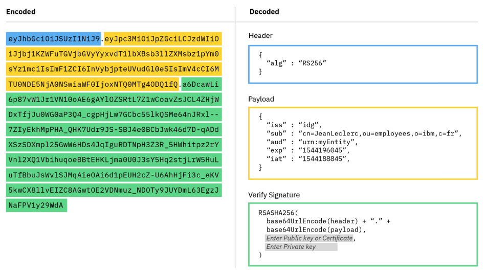

## Question

What three components make up a JSON Web Token?

## Answer

### **Header**

The header typically consists of two parts: the type of the token, which is JWT, and the algorithm that is used, such as HMAC SHA256 or RSA SHA256. It is Base64Url encoded to form the first part of the JWT.

### **Payload**

The payload contains the claims. There is a set of registered claims, for example: iss (issuer), exp (expiration time), sub (subject), and aud (audience). These claims are not mandatory but recommended to provide a set of useful, interoperable claims. The payload can also include extra attributes that define custom claims, such as employee role. Typically, the subject claim is used to create the OpenID Connect user subject. However, the Liberty JVM server can be configured to use an alternative claim. The payload is Base64Url encoded to form the second part of the JWT.

### **Signature**

To create the signature part, the encoded header and encoded payload are signed by using the signature algorithm from the header. The signature is used to verify that the issuer of the JWT is who it says it is and to ensure that the message wasn't changed along the way.
