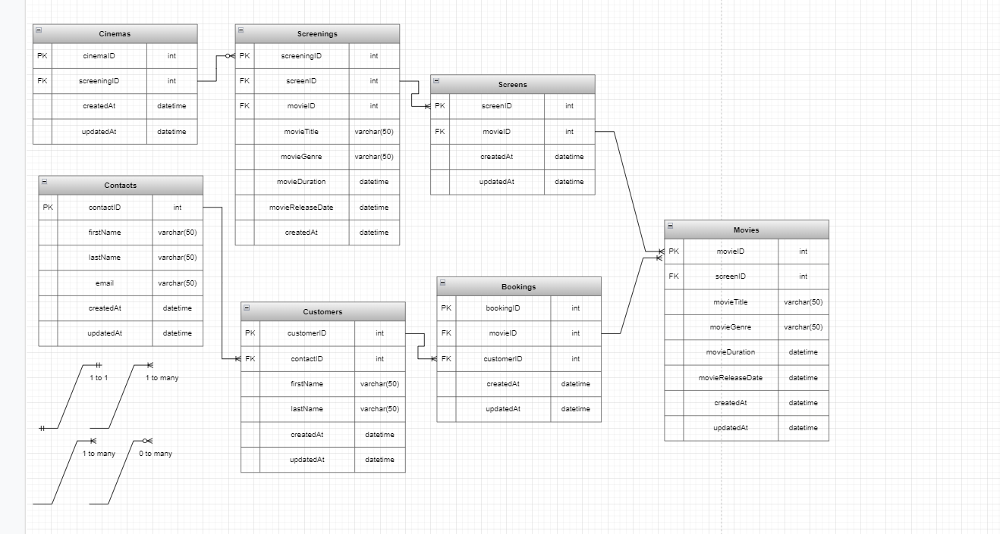

# Epic

A local cinema wants to allow people to book tickets online to see movies that are being shown in its various screens.
These tickets should be delivered to customers via email.
The cinema wants to keep a record of their customers and the tickets they purchase,
as well as offer a regularly updated list of movies for them to choose from.
A single screen might show multiple movies a day, and even the same movie at multiple times.
The cinema will expand its number of screens in the future, so the potential for growth needs to be accounted for.

# Example User Storeis

- As a customer, so I can receive my tickets, I want to provide my contact information.
- As a customer, so I can decide which movie I want to watch, I want to see a list of movies.
- As an admin, so I can manage the movies shown at the cinema, I want to update the list of movies.

# My User Stories

## Customer

- As a Customer, so I can watch a Movie at the Cinema, I want to Book a Ticket online 
  (Entities => Customers, Cinemas, Movies, Bookings)

- As a Customer, so I can decide which Movie I want to watch, I want to see a list Of Movies with their Screening details (time, screen, etc) 
  (Entities => Customers, Movies, Screenings)

- As a Customer, so I can receive my tickets or the person(s) I'm purchasing the tickets on behalf of, I want to provide my/their Contact information 
  (Entities => Customers, Contacts)

## Administrator

- As an Administrator, so I can manage the movies shown at the Cinema, I want to keep track and update the list of Movies and Screens shown 
  (Entities => Administrators, Movies, Screenings)

- As an Administrator, so I can send online tickets to the Customer, I need to record their Contact details. 
  (Entities => Administrators, Contacts)

- As an Administrator, to prevent a movie from being overbooked, I want to be able to see what the capacity of each screen is 
  (Entities => Administrators, Screenings)

- As an Administrator, so I can track the performance of my Cinemas, I want to keep track of Bookings, Movies and Screenings 
  (Entities => Administrators, Bookings, Movies, Screenings)

